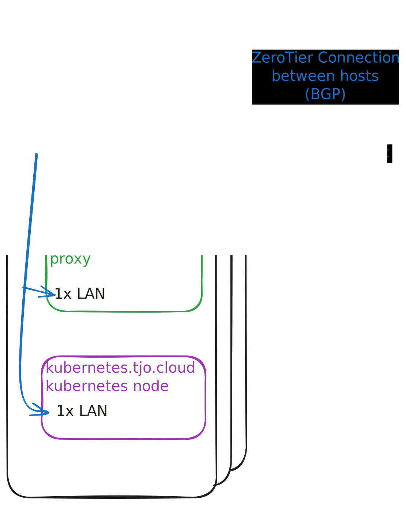

# `network.tjo.cloud`

Handling networking between nodes and between virtual machines.

# Architecture



__WAN interface__ either represents an actual public interface (on Hetzner) or an interface in home LAN that has port-forwarded ports to it from home router.

__LAN interface__ is an ordinary lan network.

__ingress.tjo.cloud__ has port-forwarded all public ports to it (22, 25, 80, 443, 587 etc.). No other VM is accessible from the internet.

__network.tjo.cloud__ establishes ZeroTier connection between other network.tjo.cloud VMs. Using BGP, each node advertises
it's subnet as well as any other advertisements it receives, like from Kubernetes cluster (Cilium BGP).

# Subnet
We are using `10.0.0.0/10` range for IPv4 as well as `fd74:6a6f::/32` for IPv6.
This is used for the whole SD-WAN.

It is further split as:

| Use                         | IPv4          | IPv6              |
|-----------------------------|---------------|-------------------|
| network.tjo.cloud - General | 10.0.0.0/16   | fd74:6a6f:0::/48  |
| k8s.tjo.cloud               | 10.8.0.0/16   | fd74:6a6f:8::/48  |

Unspecified are unused.

## network.tjo.cloud
| Host       | IPv4          | IPv6                  | BGP ASN |
|------------|---------------|-----------------------|---------|
| _reserved_   | 10.0.0.0/20   | fd74:6a6f:0:0000::/52 | 65000   |
| batuu      | 10.0.16.0/20  | fd74:6a6f:0:1000::/52 | 65001   |
| jakku      | 10.0.32.0/20  | fd74:6a6f:0:2000::/52 | 65002   |
| nevaroo    | 10.0.48.0/20  | fd74:6a6f:0:3000::/52 | 65003   |
| mustafar   | 10.0.64.0/20  | fd74:6a6f:0:4000::/52 | 65004   |
| endor      | 10.0.80.0/20  | fd74:6a6f:0:5000::/52 | 65005   |
|            | 10.0.96.0/20  | fd74:6a6f:0:6000::/52 | 65006   |
|            | 10.0.112.0/20 | fd74:6a6f:0:7000::/52 | 65007   |
|            | 10.0.128.0/20 | fd74:6a6f:0:8000::/52 | 65008   |
|            | 10.0.144.0/20 | fd74:6a6f:0:9000::/52 | 65009   |
|            | 10.0.160.0/20 | fd74:6a6f:0:a000::/52 | 65010   |
|            | 10.0.176.0/20 | fd74:6a6f:0:b000::/52 | 65011   |
|            | 10.0.192.0/20 | fd74:6a6f:0:c000::/52 | 65012   |
|            | 10.0.208.0/20 | fd74:6a6f:0:d000::/52 | 65013   |
|            | 10.0.224.0/20 | fd74:6a6f:0:e000::/52 | 65014   |
|            | 10.0.240.0/20 | fd74:6a6f:0:f000::/52 | 65015   |

Each subnet gives us 4096 IPv4 addresses per host.

### Per host designations

First 100 addresses are reserved for network and cloud operations.

| Use                      | IPv4             | IPv6                  |
|--------------------------|------------------|-----------------------|
| Virtual Machines (DHCP)  | 10.0.(y+0).0/22  | fd74:6a6f:0:y000::/54 |
|                          | 10.0.(y+4).0/22  | fd74:6a6f:0:y400::/54 |
|                          | 10.0.(y+8).0/22  | fd74:6a6f:0:y800::/54 |
| Jakob                    | 10.0.(y+12).0/22 | fd74:6a6f:0:yc00::/54 |

### Special designations

| Use            | IPv4             | IPv6                    |
|----------------|------------------|-------------------------|
| Router LAN VIP | 10.0.0.1/32      | fd74:6a6f:0:f000::1/128 |

## k8s.tjo.cloud

We use `10.8.0.0/16` and `fd74:6a6f:8::/48` subnets for Kubernetes.
We use BGP to advertise these routes (iBGP to each network.tjo.cloud ASN).

| Use              | IPv4             | IPv6                     |
|------------------|------------------|--------------------------|
| Pods             | 10.8.0.0/20     | fd74:6a6f:8:0000::/52        |
| Load Balanancers | 10.8.16.0/20    | fd74:6a6f:8:1000::/52   |
| _unused_         | xxx              | xxx                      |
| Services         | 10.8.252.0/22   | fd74:6a6f:8::3e80::/108 |

For Services we use last possible subnets.

# Setting up new Host

### 1. Add new device to terraform.tfvars.

### 2. Manually configure vmbr0 and use import to import it.

```
tofu import 'proxmox_virtual_environment_network_linux_bridge.vmbr0["nevaroo"]' nevaroo:vmbr0
```

### 3. Deploy terraform.

### 4. Set Password (see bitwarden)

### 5. Setup initial network.

```
# Fix: we want to use eth1.
# Remove all mentions of lan.
vim /etc/config/network
service network restart
```

### 5. Setup Tailscale.
Ref: https://github.com/adyanth/openwrt-tailscale-enabler

```
wget -O - https://code.tjo.space/tjo-cloud/infrastructure/raw/branch/main/network.tjo.cloud/scripts/openwrt-initial-setup.sh > initial.sh
sh initial.sh
```

### 6. Configure.

Once tailscale is up and manually configured (see the config files for guide).
We can use automated way of maintaining config.

```
just configure <node>
```


### 7. Approve ZeroTier member.

https://my.zerotier.com/network/b6079f73c6379990

At this point, an ipv4 and ipv6 will be assigned. We have to write that to `configs/common.yaml` and
run `just configure <node>` again.

# TODO

## Use gitops for tailscale ACL.

Current version is an snapshot in time, more as an example then actual version used.

## IPv6 Connectivity.

As we assign private ipv6 addresses, we would have to ise ipv6 nat to translate those to real ipv6 addresses.
