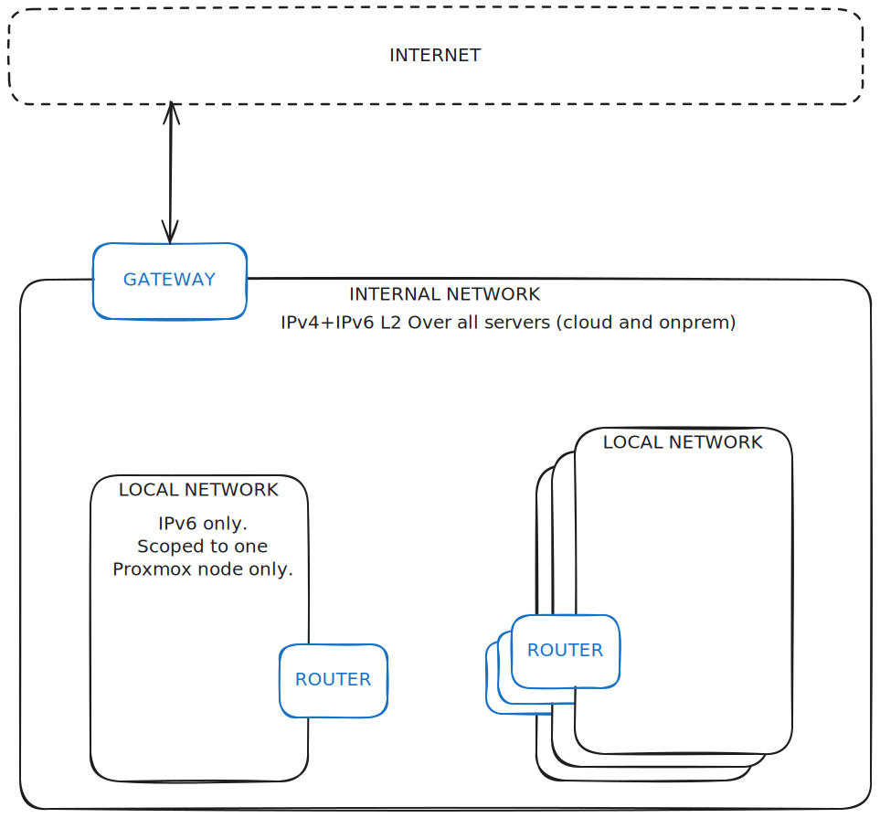

# `network.tjo.cloud`

Handling networking between nodes and between virtual machines.

# Architecture



### Wireguard Network
This network is used to connect local networks together as well as ataching any external (Hetzner Cloud etc.)
virtual machine to the network.

All devices here use static IPv6 addresses.

### Local Network
This are L2 IPv6 networks for specific Proxmox Host. Reason to have this is so that all VM's on that
host have _next hop_ as the local router. Which can then do DNS, NTP, BGP and further routing.

# Subnets

- network.tjo.cloud where `fd74:6a6f::/32` and `2a01:4f8:120:7700::/56` subnets are used.
- [k8s.tjo.cloud](../k8s.tjo.cloud/README.md) where the `fd9b:7c3d:7f6a::/48` subnet are being used.

## network.tjo.cloud

### BGP

Each router instance establishes iBGP peering with all others.
ASN 65000 is used. Each router also listens for any iBGP peerings.
This is used for `k8s.tjo.cloud` where cilium advertises pod and external load balancer ips.

### Subnets

| Node           | Internal            | Public                 |
|----------------|---------------------|------------------------|
| #              | #                   | #                      |
| nevaroo          | fd74:6a6f:0:10::/64 | 2a01:4f8:120:7710::/64 |
| endor          | fd74:6a6f:0:11::/64 | 2a01:4f8:120:7711::/64 |
| batuu          | fd74:6a6f:0:12::/64 | 2a01:4f8:120:7712::/64 |
| jakku          | fd74:6a6f:0:13::/64 | 2a01:4f8:120:7713::/64 |
| mustafar       | fd74:6a6f:0:14::/64 | 2a01:4f8:120:7714::/64 |
| #              | #                   | #                      |
| Wireguard  | fd74:6a6f:70::/64 | # |
| #              | #                   | #                      |
| router/gateway VIP  | fd74:6a6f:53::/64 | # |

The `nevaroo` node is special gateway node. This once routes traffic out to the internet
and it has the public `/56` routed to it.

### Special designations

| Use                   | IPv6                     |
|-----------------------|--------------------------|
| # | # |
| upstream router (vip) | fd74:6a6f:53::53/128 |
| # Wireguard | # |
| nevaroo.network.tjo.cloud (acting as gateway) | fd74:6a6f:70::1/128  |
| nevaroo.network.tjo.cloud | fd74:6a6f:70::10/128  |
| endor.network.tjo.cloud | fd74:6a6f:70::11/128  |
| batuu.network.tjo.cloud | fd74:6a6f:70::12/128  |
| jakku.network.tjo.cloud | fd74:6a6f:70::13/128  |
| mustafar.network.tjo.cloud | fd74:6a6f:70::14/128 |


# Setting up new Host

### 1. Add new device to terraform.tfvars.

### 2. Deploy terraform.

### 3. Configure.

```
# 1. Manually configure /etc/config/{firewall,network} to get ip and allow ssh
# 2. Then do the changes in the `prepare.sh` file manually.
# 3. Finally, run the configure.

just configure <node>
```

# TODO

## Use gitops for tailscale ACL.

 - [ ] Current version is an snapshot in time, more as an example then actual version used.

## Selfhost Zerotier.

 - [ ] Use [ztnet](https://github.com/sinamics/ztnet).
 - [ ] Deploy an instance on hetzner cloud. Same as it was done for id.tjo.cloud.
