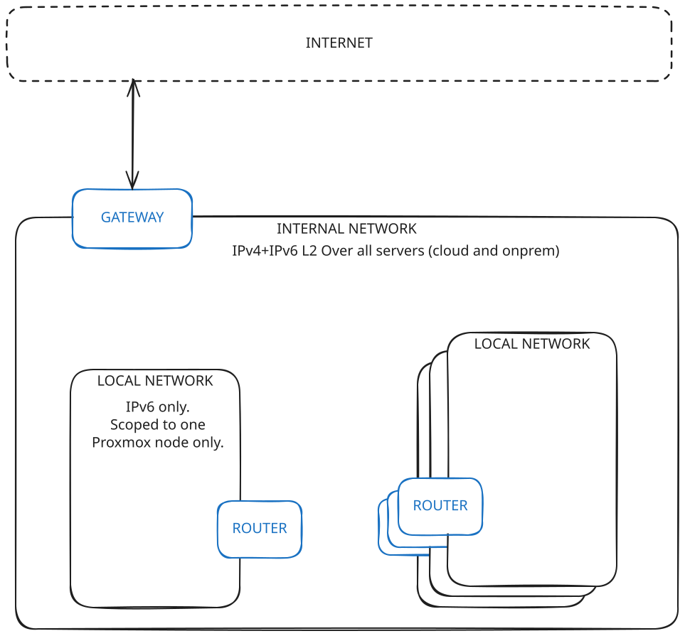

# `network.tjo.cloud`

Handling networking between nodes and between virtual machines.

# Architecture

### Wireguard Network
This network is used to connect local networks together as well as attaching any external (Hetzner Cloud etc.)
virtual machine to the network.

All devices here use static IPv6 addresses.

### Local Network
This are L2 IPv6 networks for specific Proxmox Host. Reason to have this is so that all VM's on that
host have _next hop_ as the local router. Which can then do DNS, NTP, BGP and further routing.

# Subnets

- network.tjo.cloud where `fd74:6a6f::/32` and `2a01:4f8:120:7700::/56` subnets are used.
- [k8s.tjo.cloud](../k8s.tjo.cloud/README.md) where the `fd9b:7c3d:7f6a::/48` subnet are being used.
- TODO: Request DN42 addresses.

## network.tjo.cloud

### Subnets

| Node           | Internal            | Public                 |
|----------------|---------------------|------------------------|
| nevaroo host   | #                   | 2a01:4f8:120:7700::64  |
| #              | #                   | #                      |
| nevaroo          | fd74:6a6f:0:10::/64 | 2a01:4f8:120:7710::/64 |
| endor          | fd74:6a6f:0:11::/64 | 2a01:4f8:120:7711::/64 |
| batuu          | fd74:6a6f:0:12::/64 | 2a01:4f8:120:7712::/64 |
| jakku          | fd74:6a6f:0:13::/64 | 2a01:4f8:120:7713::/64 |
| mustafar       | fd74:6a6f:0:14::/64 | 2a01:4f8:120:7714::/64 |
| #              | #                   | #                      |
| router/gateway VIP  | fd74:6a6f:53::/64 | # |
| #              | #                   | #                      |
| Wireguard  | fd74:6a6f:70::/64 | # |

The `nevaroo` node is special gateway node. This once routes traffic out to the internet
and it has the public `/56` routed to it. We use addresses from first /64 for the host itself (proxmox and router vm).

### Wireguard and BGP

| Node                       | ID | IPv6                     | ASN    |
|----------------------------|----|--------------------------|--------|
| #                          | #  | #                        | 65000  |
| nevaroo.network.tjo.cloud  | 10 | fd74:6a6f:70::10/128     | 65010  |
| endor.network.tjo.cloud    | 11 | fd74:6a6f:70::11/128     | 65011  |
| batuu.network.tjo.cloud    | 12 | fd74:6a6f:70::12/128     | 65012  |
| jakku.network.tjo.cloud    | 13 |fd74:6a6f:70::13/128     | 65013  |
| mustafar.network.tjo.cloud | 14 |fd74:6a6f:70::14/128     | 65014  |
